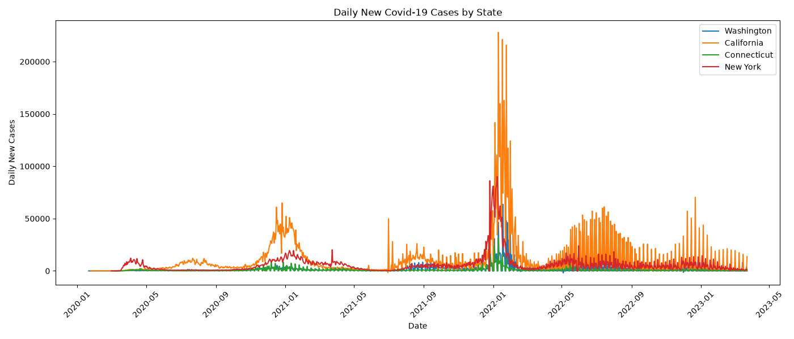
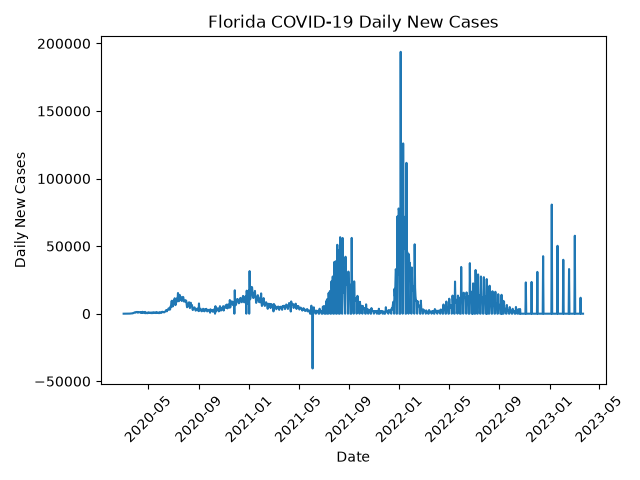

# CBB-6340
Xintong Chen
NetID: xc463

# Exercise 1: Analyzing COVID-19 Case Data
## Repository Files

- `hw1.py`: Main Python script containing the data loading, visualization, peak-date analysis, and Florida anomaly analysis.
- `us-states.csv`: COVID-19 case data from The New York Times.
- `daily_cases.png`: Visualization of daily new COVID-19 cases for selected states.
- `fl_plot.png`: Visualization of daily new COVID-19 cases for Florida.


These data are obtained from [The New York Times COVID-19 Data repository](https://github.com/nytimes/covid-19-data)


## Key Outputs, Figures, and Visualizations
### 1a. Data Acquisition & Loading
The dataset contains **61,942 observations and 5 columns**:

- `date`
- `state`
- `fips`
- `cases`
- `deaths`

The dataset contains **56 geographic entities**, including U.S. states, Washington D.C., and several U.S. territories.

The `date` column was initially stored as strings and was converted to pandas datetime objects using `pd.to_datetime()`.

### 1b. Visualization of Daily New Cases
The original `cases` column contains cumulative reported case counts rather than daily new cases. Daily reported cases were calculated by taking the difference between consecutive cumulative case counts.

The `plot_daily_cases()` function accepts a list of state names and creates an overlaid line plot showing their daily reported cases over time.

### Figure



### Key Observations

The visualization shows that the three states have different patterns and timing of reported COVID-19 case increases.

Daily reported case counts are highly variable over time, with several sharp spikes rather than smooth trends. Florida shows particularly large spikes compared with the other states.

The figure also demonstrates that daily reported case counts can contain substantial short-term variation. Therefore, a single-day maximum should be interpreted carefully because it may reflect reporting patterns rather than the true timing of infections.


### 1c. Identifying Peak Case Dates
The `get_peak_date()` function identifies the date on which a state experienced its highest calculated number of daily reported cases.

Example outputs:

```text
Washington peak: 2022-01-18
Connecticut peak: 2022-01-10
```

### Key Outputs

- Washington's highest reported daily case count occurred on **January 18, 2022**.
- Connecticut's highest reported daily case count occurred on **January 10, 2022**.


### 1d. Comparing Peak Dates Between States

The `compare_peak_dates()` function compares the peak dates of two states and calculates the exact number of days between their peaks.

Example output:

```text
Connecticut reached its peak first.
The peaks were 8 days apart.
```

### 1e. Florida Anomaly Analysis

The Florida data contain several unusually large changes in reported daily cases.

### Largest Positive Changes

| Date | Daily Reported Cases |
|---|---:|
| January 4, 2022 | 193,786 |
| January 10, 2022 | 125,996 |
| January 18, 2022 | 111,621 |
| January 6, 2023 | 80,749 |

### Largest Negative Change

| Date | Daily Reported Cases |
|---|---:|
| June 4, 2021 | -40,527 |

### Figure



### Key Observations

Florida's largest calculated daily increase was **193,786 cases on January 4, 2022**, which is substantially larger than the surrounding daily values.

The data also contain a negative daily value of **-40,527 cases on June 4, 2021**. Because daily cases were calculated from changes in cumulative reported cases, this negative value does not represent a real decrease in infections.

Instead, it likely reflects a revision, correction, or other adjustment to previously reported cumulative case totals.

The unusually large positive spikes may similarly reflect reporting delays or backlogged cases being added to the cumulative total on a later reporting date.


---

# Code Evolution

The project developed incrementally from the initial in-class studio sketch to the final version. I first loaded the New York Times COVID-19 dataset with pandas and inspected the structure, columns, number of observations, state names, and data types. This initial inspection helped establish what information was available and revealed that the `cases` column contained cumulative rather than daily case counts.

I then converted the `date` column to datetime objects so that dates could be used correctly for plotting and comparison. Before creating generalized functions, I explored the data for an individual state, using California as an example. I compared consecutive cumulative case counts and calculated their differences to verify how daily reported cases could be derived.

After validating this approach, I created the `plot_daily_cases()` function to apply the same calculation to multiple states and visualize their trends together. I then developed `get_peak_date()` to identify the date associated with the highest calculated daily case count. Finally, I created `compare_peak_dates()` to compare the peak dates of two states and calculate the difference between them.

For the final part of the exercise, I analyzed Florida separately. I used both visualization and numerical inspection of extreme values to identify unusual reporting patterns. This step helped me recognize that the calculated daily case values can be strongly affected by reporting delays, corrections, and revisions to cumulative data.

---

# Design Choices and Trade-offs

A major design choice was to calculate daily reported cases by taking the difference between consecutive cumulative case counts. This approach is simple, reproducible, and directly follows from the structure of the dataset. It also avoids requiring an additional source of daily case data.

However, this approach has an important limitation: the resulting daily values represent changes in reported cumulative case counts rather than necessarily the number of infections that occurred on that specific date. Reporting delays, backlogs, corrections, and changes in reporting practices can therefore create unusually large positive or negative values.

The first observation for each state has no previous observation with which to calculate a difference, resulting in `NaN`. I used `fillna(0)` for the visualization and subsequent processing so that the resulting series could be handled consistently. This is a practical choice, but the resulting zero should not be interpreted as evidence that exactly zero cases occurred on the first recorded date.

I used line plots to visualize daily reported cases because they make changes over time and differences between states easy to see. The trade-off is that daily reported data can be noisy and contain sharp spikes. A smoothed or weekly-average visualization could make broader trends easier to interpret, but the exercise specifically asks for daily new cases.

For peak identification, I used the maximum calculated daily reported case count as the definition of a peak. This follows the wording of the exercise and provides a clear and reproducible rule. However, the identified peak may be influenced by reporting artifacts and therefore should not automatically be interpreted as the true epidemiological peak.

---

# Key Findings

The analysis demonstrates that reported COVID-19 case trends varied substantially across states. In the example comparison, Connecticut reached its highest calculated daily reported case count on January 10, 2022, while Washington reached its peak on January 18, 2022. Connecticut therefore reached its peak **8 days earlier** than Washington.

The visualization of multiple states also shows that reported daily case counts are highly variable over time. Different states exhibit different timing and magnitudes of increases, and individual days can contain sharp spikes that stand out from the surrounding observations.

The Florida analysis highlights an important limitation of working with cumulative reported case data. The very large positive value of **193,786 cases on January 4, 2022** and the negative value of **-40,527 cases on June 4, 2021** demonstrate that calculated daily case counts can be strongly affected by reporting practices and revisions.

These findings suggest that the dataset is useful for examining reported case trends, but individual daily values and peak dates should be interpreted with caution. The exercise also demonstrates the importance of examining intermediate outputs and visualizations before making conclusions from real-world data.